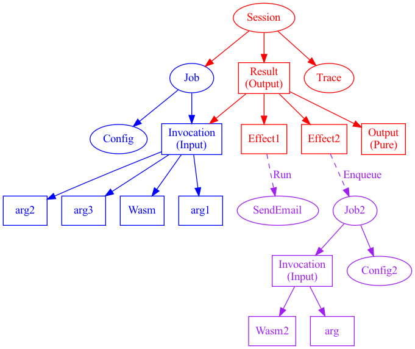

# IPVM

This document currently describes the high-level project goals.

# 🤹‍♀️ Separate Projects

1. Autocodec
2. wasm-ipfs
3. IPVM

These are related, but separate. The relatedness comes from the fact that if we have one Wasm engine in IPFS, then the other components can rely on it too.

# :no_good_woman: Antigoals: What An IPVM Is Not

* A replacement of IPFS internals — that's wasm-ipfs
* A language for distributed applications
* A WASI interface
* A new blockchain

# What Is An IPVM?

To date, IPFS has been a project focused on data. IPVM is the codename for an attempt to bring execution to IPFS. To this end, IPVM aims to be the easiest, fastest, most secure, and open way to run Wasm anywhere.

Another way to describe IPVM would be "an open, decentralized, and local-first competitor to AWS Lambda".

The project leverages Wasm, content addressing, SPKI, and object capabilities to liberate computation from depending on specific prenegotiated services like the big cloud providers. Execution should scale flexibly from on-device by default all the way up to edge PoPs and data centers.

## 📋 High-Level Attributes

* Wasm-on-IPFS
* Declarative invocation (not an ABI, see section below)
* Captured results, re-ingested to IPFS
* A distributed scheduler
  * Single vs cron, local vs remote vs either, etc
* Matchmaking
  * Poster/acceptor 
  * Push-to-remote
* (Global) memoization table & adaptive optimization
* Managed effects (via an IPVM runtime)
* Mobile (ambient) computing, compute-to-data, and data-to-compute
* "The HTTP of Compute"
* Stretch: autonomous agents

## :woman_scientist: Research Questions

### Pragmatics

Projects like IPVM live and die by balancing power with ease of use. What are the easiest models for users to interact with the system? Clearly BYOL (bring-you-own-language) is a major advantage of Wasm. Are the specific Wasm runtimes that are easier to work with than others?

The current hypothesis is "convention over configuration" for defining attributes such as when effects should be run, if subjobs are run concurrently, and so on. One direction is to ask developers to configure a small-but-consistent input and output data structure (e.g. as you often see in middleware). This would open up dataflow analysis and (likely pessimistic) call-by-need semantics ("forcing the effect thunks"), removing the need for complex configuration and strategies from the developer, unless they want to overwrite them.

### Cost semantics

* Can it run locally vs incur network to kick over to a more powerful machine?
* To what degree is it possible to hide this complexity from the programmer?

### Trust & Verification Model

* Who can decrypt this data?
* How do I know that this is the right answer?
* Who are bad actors in the system?
Are there opportunities for correct-by-construction code?

### Matchmaking & Discovery

* How quickly can a posted job be executed
* Who is equipped to run specific functionality or effects?
* How do we prevent wasted duplicate computation?
* What does a push model look like in this model (e.g. to a specific provider)

### Effect Systems

* "Don't accidentally send the Tweet twice"
* What's the best way to fit effects into a pure invocation model?
* How can we check that it actually ran?
* Should continuations be modelled as delimited effects?
  * If so, perhaps the runtime should have low-ish level `shift` & `reset` calls
* How hard should we lean into defunctionalization?
* Should we support message passing and/or IPC?

### Cooperative Optimization

* Do typical compiler and VM techniques like JIT and memoization apply?
  * Can we share intermediate results of a computation and store them in a global substrate that anyone can participate in?

## 📃 Declarative Invocation

The current hypothesis is that invocations can be configured as a declarative description containing at least:

* The CID of the Wasm blob to execute
* The CIDs of the argument
* Any configuration that overrides defaults
    * Max gas
    * When to run (i.e. cron)
    * Associated UCAN or CapTP
    * ...and so on...

## 🧾 Captured Session / Receipts

The output may include instructions to run further computation (e.g. continuations or other effects). Represented in the diagram below as a dashed line, sending email or enqueuing a new job are handled by the IPVM runtime. [NB: The exact mechanism is not settled, the exact mechanisms are all subject to change]

## :spiral_calendar: Scheduler

IPVM needs a way of scheduling computation, signalling made matches, returning control to the job queue, and starting continuations? Linearizability is possibly required in the general case; what's the easiest way to signal weaker consistency? How does the scheduler handle failure of nodes, network partitions, etc?

What are the correct default behaviours? Should IPVM computation always operate by (concurrent) graph reduction, or do we need to specify evaluation (and restart) strategies a la Erlang?

## :handshake: Trust Model

UCAN & OCAP/CapTP
Execution Metering

* https://github.com/ucan-wg/spec
* https://spritelyproject.org/news/what-is-captp.html

IPVM will often (not always!) execute on remote machines controlled by untrusted third parties. This is potentially precarious for all involved. Some trust is required between participants in all cases.

In offline scenarios, such trust may be provided via SPKI. In live systems, ocap (likely CapTP) should be preferred.

### Open Questions

* Is gas granted directly by capability? (i.e. is gas first-class or an effect?)
* Can SPKI and CapTP interoperate directly?

## :dollar: Payments

Computation is a scarce resource. IPVM is not anti-money; while altruistic computation is _highly encouraged,_ charging for computation is going to quickly become a de facto requirement. The current hypothesis is to bake micropayment capabilities directly into the platform to avoid the immediate capture by prenegotiated providers.

IPVM aims to not have an "IPVM token" or similar. Prenegotiated providers paid in fiat and metered in credits SHOULD be supported, as should a "spot market" of compute resources on an ad hoc basis. To maximize user choice, this system should be kept _out or on the fringes_ of the IPVM kernel as much as possible. IPVM MUST still allow for running compute yourself, or pushing compute to machines that you or a friendly agent controls "for free".

* State channels
  * ucan-chan (ユーキャンちゃん!)
* Hierarchical consensus and/or Filecoin

## :rocket: Managed Effects

Effects are the things that happen outside of pure functions: sending email, retrying a failed execution, reading from a database, playing a bell, firing the missiles.

Managed effects are handled by the compiler, VM, or runtime. The current hypothesis contains two levels of effect: pure ("platform") effects and impure effects. For completeness, you could say that pure functions are "non-effectful" and also exist on this spectrum of effectfulness.

Pure effects are ones that "merely" paper over pure functions with helpful abstractions (e.g. implicit state, error handling, continuations). Another way of thinking about them is that they stay "contained" in the system. We can roll back any of these operations, replay them, etc and aside from your CPU generating some extra heat, no one would be the wiser.

Impure effects alter the world itself. If I send an email, I'm unable to reverse that action.

Pure effects are much more convenient to reason about, compose cleanly, and are inspectable. We want to capture as much of an impure effect as possible as pure descriptions. Returning "receipts" from an impure effect can turn a "request for effect" to a pure description of "...and it returned this specific result", which is a pure tuple. Treating it this way allows for idempotence on a stream of effects over time, capture and reuse of intermediate results, and so on.

Impure effects are very powerful, but with great power comes great responsibility... and also often fewer levers for performance optimization. One example is that impure effects often need exactly-once semantics, which requires gaining a global lock on the job (individual effects may be run in parallel, but need to be the only execution for that specific effect). This requires consensus, sometimes even global distributed consensus, which is always slower than being able to work from a distributed queue.

In general, the number of hosts that can provide a particular effect are smaller than the hosts that can compute pure functions. There may simply be a tradeoff for the programmer to say "yes I really need this effect, even though I'll have fewer options".

### What About WASI?

We will almost certainly need to enable WASI at some stage. This is much more complex, as service discovery becomes a larger, and much more nuanced problem as arbitrary effects can be very difficult to make safe and deterministic. For example, what if the executable fills your disk with garbage?

Should the core IPVM runtime provide "blessed" effects that operate over the shared memory interface? For example, I see no problem with providing a source of randomness as an external effect because it's useful, and probably safe. It "just" needs to come from "outside" the computation. These can even be captured in the trace.

## :telescope: Sources of Inspiration

We can learn a lot from adjacent projects. Some of these include:

* WASI
* FVM
* Bacalhau
* BucketVM
* IPFS-FAN
* Bloom^L
* PACT/HydroLogic
* Nix
* Dialog

## :world_map: Roadmap

### A. Learning Phase

1. Bash-script store/load/run Wasm from IPFS
1. Memoization table 
    * Local
    * Remote, incl demo "look how fast it is on a remote machine now"
1. Bash-script module pipelining, capturing intermediate results
1. Experimentation with ABI (C conventions?)
1. Pure effects (e.g. atomic FS or DB read/write)
1. Initial attempt to run adaptive optimization on common partial applications

### B. Specs

* IPLI & session receipts
* Scheduler & matchmaking
* Memoized result format & lookup
* Capability model
    * Offline (SPKI)
    * Online (ocap/CapTP)
* Verification mechanisms
* Compute on encrypted data (trusted & FHE)

# FAQ

## How Does This Differ From Autocodec and wasm-ipfs?

Autocodec, IPVM, and wasm-ipfs all involve Wasm and IPFS. They are distinct projects, though sharing modules and learning between them is a nice-to-have. Having a Wasm interpreter in every IPFS node makes the argument for all of these projects much easier.

wasm-ipfs is the replacement of IPFS internals with Wasm, to help share high-quality components across implementations and platforms.

Autocodec is an attempt to replace in-built IPFS codecs with an ad hoc mechanism at read-time. The basic idea is "what if the codec executable was wrapped directly around the IPLD to interpret?"

IPVM is a distributed execution engine, scheduler, service discovery layer / matchmaking, and memoization system. It is possibly the largest of the three projects. If wasm-ipfs is "IPFS _as_ Wasm", then IPVM is "Wasm _on_ IPFS"

## Resources

https://www.youtube.com/watch?v=rzJWk1nlYvs
